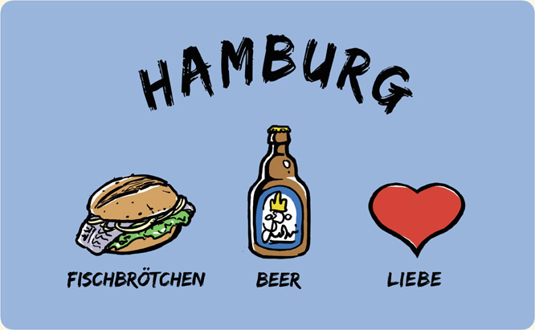
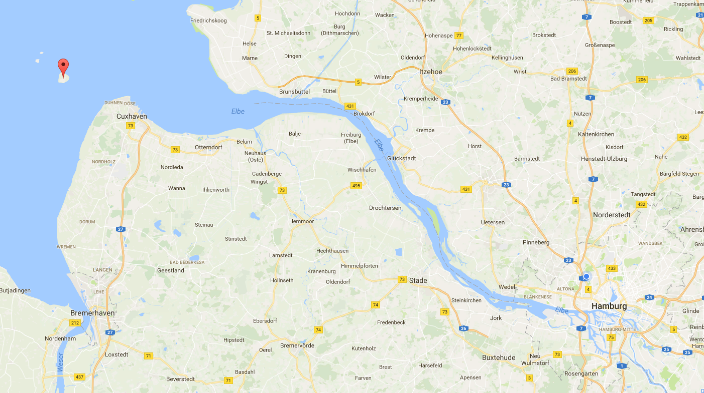
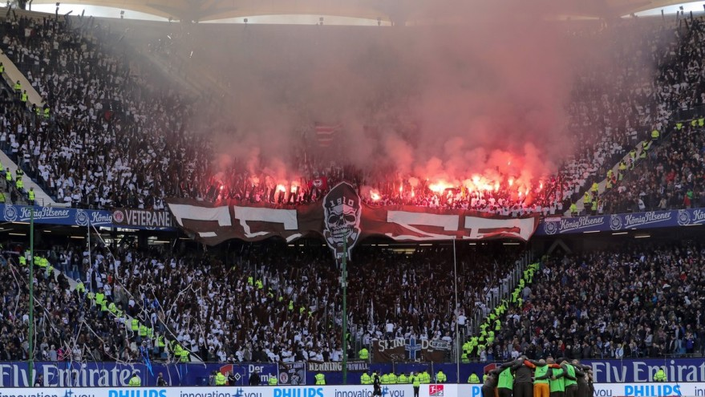
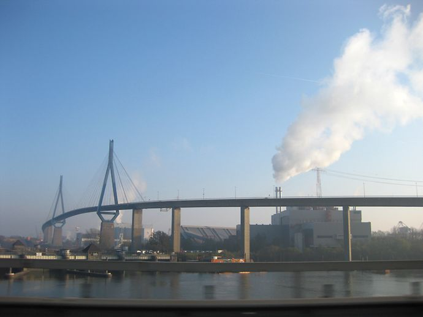
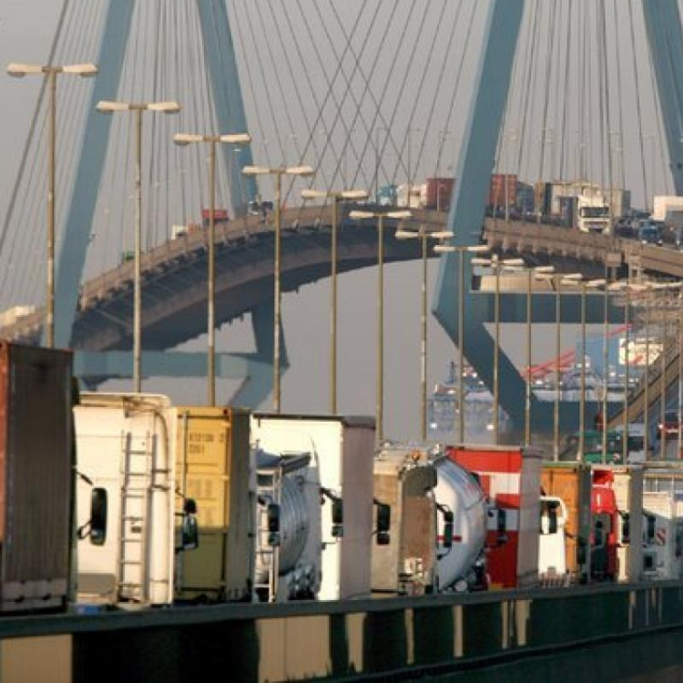
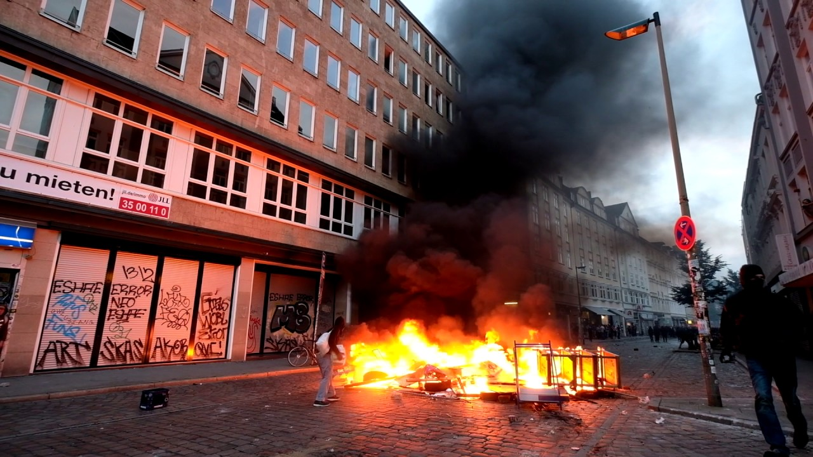
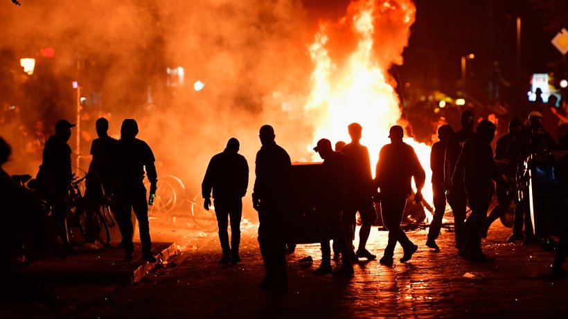
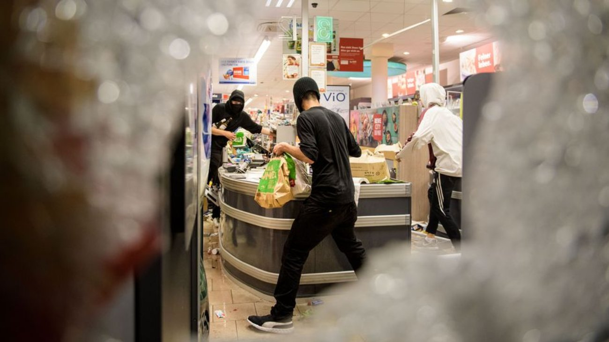
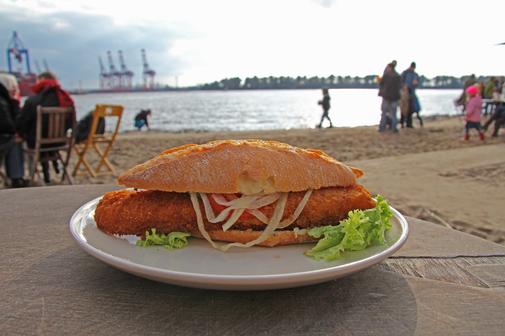

## irgendwas mit ~~Franz~~Fischbrötchen
Freddy 3Wille

## Hamburg? Wo ist das eigentlich?

# Fakten, Fakten, Fakten

mehr Brücken als Venedig und Rotterdam zusammen (2500)

Altona benannt nach Kneipe, die "all to nah" an der Stadtgrenze lag
Note: Außerhalb gabs keine Steuern

Bhf Altona ältester Kopfbahnhof
Note: meiste Fernbahnhöfe Deutschlands

Ältestes Gebäude steht auf der Insel Neuwerk

Hagenbecks Tierpark erster Tierpark der Welt
Note: Tierpark =?= Zoo ohne Zäune

Davidwache: kleinstes Revier Deutschlands

Zeitungsverlage aus Hamburg machen >50% des Umsatzes in Deutschland

Geburtsort von Angela Merkel

in 2008 wurde Hamburger Innensenator zum "Abschiebeminister" erklärt

Mehr Millionäre als in jeder anderen deutschen Stadt

Vorletzter Platz bei Pisa trotz höchsten pro-Kopf Ausgaben

Erstes Brennstoffzellen-Personenschiff heißt "Alsterwasser"

In Wedel werden einlaufende Schiffe mit Nationalhymne und Flagge begrüßt
Note: Schiffsbegrüßungsanlage
Hymnen werden von Kassetten abgespielt
eine Begrüßung, eine Abschied

Metropole 7x größer als Paris und doppelt so groß wie London

eine von 6 Städten die 2 Fußballvereine gleichzeitig in der 1. Bundesliga hatten

## Wahrzeichen

## Michel

## Elbphilharmonie

## Hafen

## Reeperbahn

## Sternschanze

# mmmmm Lecker

# Schnack

## Moin

## Tschüss

## Hummel hummel

## Mors mors
