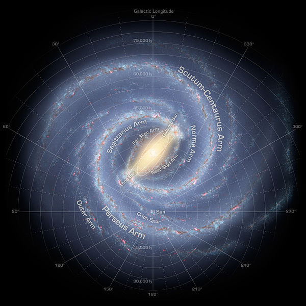
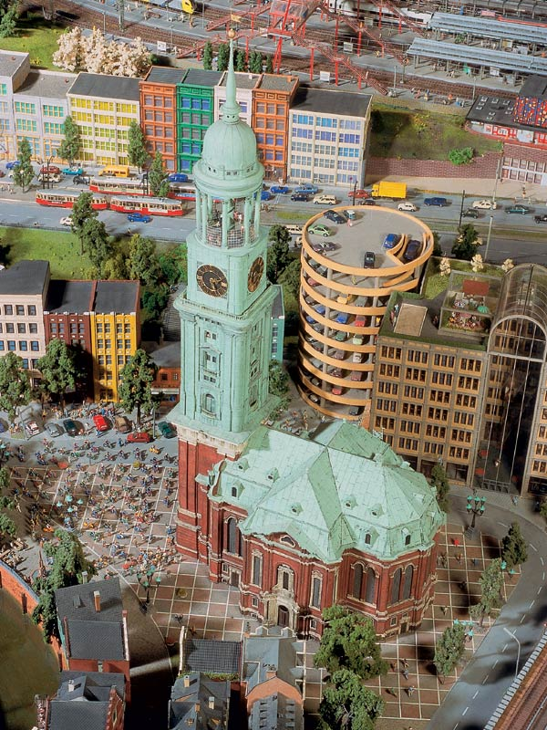
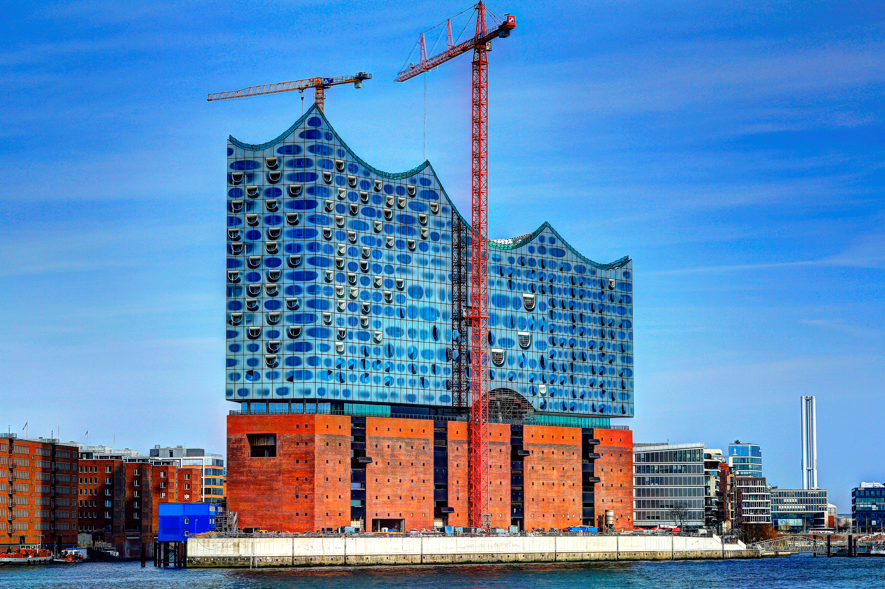
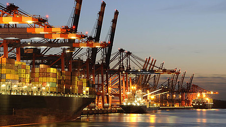
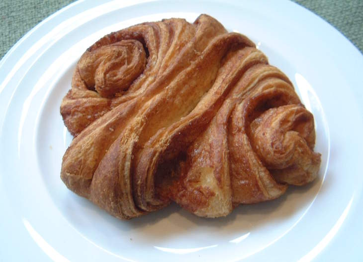
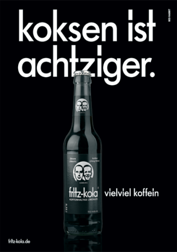
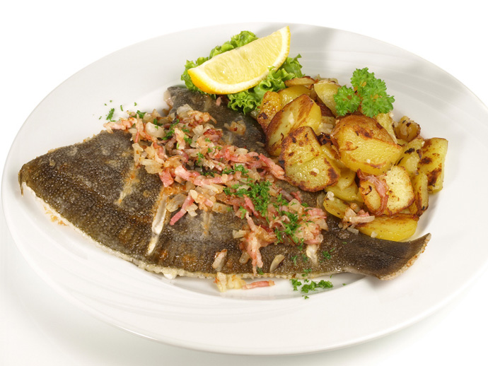
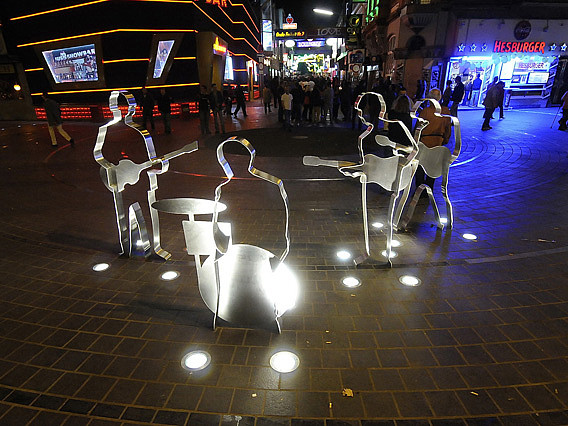

## irgendwas mit Franzbrötchen
Freddy 3Wille

## Hamburg? Wo ist eigentlich?

# Fakten, Fakten, Fakten

mehr Brücken als Vendedig und Rotterdam zusammen(2500)

Altona benannt nach Kneipe, die "all to nah" an der Stadtgrenze lag
Note: Außerhalb gabs keine Steuern

Bhf Altona ältester Kopfbahnhof
Note: meiste Fernbahnhöfe Deutschlands

Ältestes Gebäude steht auf der Insel Neuwerk(Kartenausschnitt?)

Hagenbecks Tierpark erster Tierpark der Welt
Note: Tierpark =?= Zoo ohne Zäune

Davidwache: kleinstes Revier Deutschlands

Zeitungsverlage aus Hamburg machen >50% des Deutschenumsatz

Geburtsort von Angela Merkel

in 2008 wurde Hamburger Innensenator zum "Abschiebeminister" erklärt

Mehr Millionäre als in jeder anderen deutschen Stadt

Vorletzter Platz bei Pisa trotz höchsten pro-Kopf Ausgaben

Erstes Brennstoffzellen Personenschiff heißt "Alsterwasser"

In Wedel werden einlaufende Schiffe mit Nationalhymne und Flagge begrüßt
Note: Schiffsbegrüßungsanlage
Hymnen werden von Kasetten abgespielt

7x größer als Paris und doppelt so groß wie London

eine von 6 Städten die 2 Fußballvereine gleichzeitig in der 1. Bundesliga hatten

# Schnack

## Moin

## Tschüss

## Hummel hummel

## Mors mors

## Wahrzeichen

## Michel

## Elbphilharmonie

## Hafen

# mmmmm Lecker

# Kiez

Kneipen

Discos

Shoppen

Hotels

Essen

Bordelle
Note: Die Herbertstraße dürfen außer den dort arbeitenden Prostituierten nur Männer betreten.
