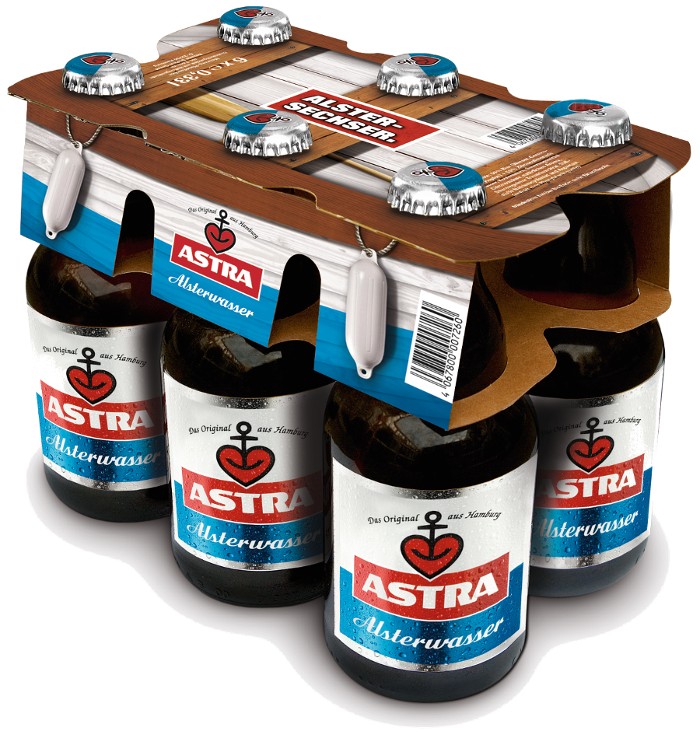
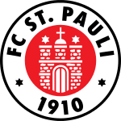

## What the hell is a Franzbrötchen?
Frederik Wille

## Hamburg? How to get there?

# Facts, Facts, Facts

more bridges than (Venice + Rotterdam) (2500)

Altona called after pub, which is "all to nah"(way too close) to city border
Note: Außerhalb gabs keine Steuern

Altona oldest railhead/terminal station in Germany
Note: meiste Fernbahnhöfe Deutschlands

Oldest standing building is on "Neuwerk"

"Davidwache": smallest precinct in Germany

Newspaper generate 50% of Germany-wide revenue

Birthplace of Angela Merkel

Most millionaires in Germany

Second to last place in education test with highest expense per capita

First wold-wide fuel cell boat called "Alsterwasser"

Incoming ships are greeted with national anthem and national flag
Note: Schiffsbegrüßungsanlage
Hymnen werden von Kassetten abgespielt
eine Begrüßung, eine Abschied

Area: 7x Paris and 2x London

1 of 6 German Cities with 2 soccer clubs in "Bundesliga"

## Wahrzeichen

## Michel

## Elbphilharmonie

## Harbour

## Reeperbahn

## Sternschanze

# mmmmm yummy

# local Language

## Moin

## Tschüss

## Hummel hummel

## Mors mors
